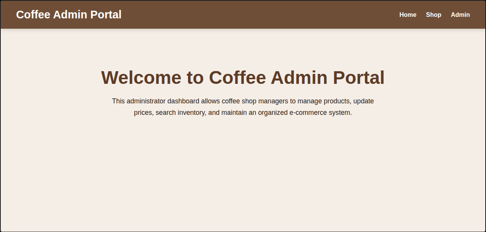
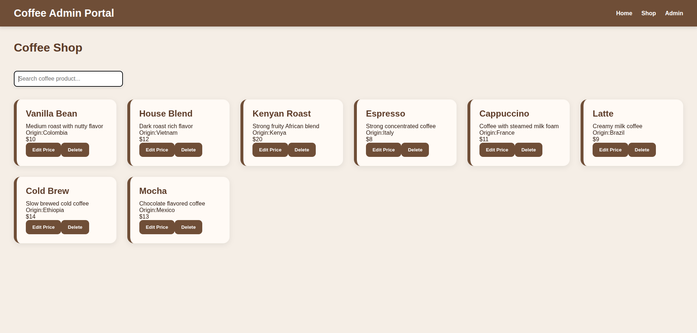
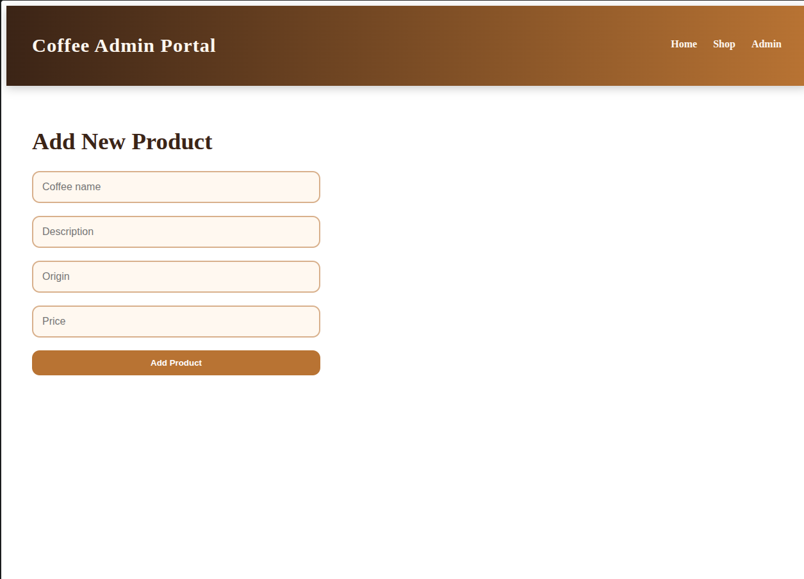

# ☕ Coffee Admin Portal

A modern React-based administrator portal for managing coffee shop products dynamically.

This project was developed as part of the Moringa School Software Engineering Program and demonstrates modern frontend development concepts including React Hooks, Context API, client-side routing, CRUD operations, reusable components, and testing.

---

# 🌐 Live Demo

🔗 Render Deployment:  
https://coffee-admin-portal.onrender.com/

🔗 GitHub Repository:  
https://github.com/tkaim88/coffee-admin-portal

---

# 📌 Project Description

Coffee Admin Portal is a Single Page Application (SPA) built using React and Vite that allows administrators to manage coffee products within a coffee shop environment.

The application simulates a backend using `json-server` and allows users to perform complete CRUD operations while demonstrating key frontend development principles.

The portal enables users to:

- View available coffee products
- Search products dynamically
- Add new products
- Edit product prices
- Delete products
- Navigate between pages without reloading

---

# 🖼️ Screenshots

## Home Page



---

## Shop Page



---

## Admin Panel



---

# 🚀 Features

## ✅ Landing Page

Displays welcome information and allows users to search products.

---

## ✅ Product Listing

Displays coffee products dynamically using React rendering with:

```js
map()
```

---

## ✅ Search Functionality

Filters products dynamically as users type.

Uses:

```js
filter()
includes()
```

---

## ✅ Add Product

Allows administrators to create new products using controlled React forms.

---

## ✅ Edit Product Price

Allows administrators to update product prices dynamically.

---

## ✅ Delete Product

Allows administrators to remove products from inventory.

---

## ✅ Full CRUD Operations

Implemented using:

- GET
- POST
- PATCH
- DELETE

---

## ✅ Client-side Routing

Implemented with React Router to create a seamless SPA experience.

Routes include:

- `/`
- `/shop`
- `/admin`

---

## ✅ Responsive Design

Responsive grid layout supports desktop and mobile screens.

---

## ✅ Component Testing

Testing implemented using:

- Jest
- React Testing Library

---

# 🛠️ Technologies Used

Frontend Technologies:

- React
- Vite
- JavaScript (ES6)
- HTML5
- CSS3
- React Router DOM

State Management:

- useState
- useEffect
- useContext
- Custom Hooks

Backend Simulation:

- json-server

Testing:

- Jest
- React Testing Library

Version Control:

- Git
- GitHub

Deployment:

- Render

---

# 📂 Project Structure

```bash
coffee-admin-portal/
│
├── src/
│   │
│   ├── components/
│   │   ├── Navbar.jsx
│   │   ├── ProductCard.jsx
│   │   ├── ProductForm.jsx
│   │   └── SearchBar.jsx
│   │
│   ├── context/
│   │   └── ProductContext.jsx
│   │
│   ├── hooks/
│   │   └── useProducts.js
│   │
│   ├── pages/
│   │   ├── Home.jsx
│   │   ├── Shop.jsx
│   │   └── Admin.jsx
│   │
│   ├── __tests__/
│   │   ├── Navbar.test.jsx
│   │   └── ProductCard.test.jsx
│   │
│   ├── App.jsx
│   ├── App.css
│   ├── main.jsx
│   └── index.css
│
├── db.json
├── package.json
└── README.md
```

---

# 🌳 Application Component Hierarchy

```bash
main.jsx
│
└── ProductProvider
      │
      └── App.jsx
            │
            ├── Navbar
            │
            ├── Home
            │     │
            │     └── SearchBar
            │
            ├── Shop
            │     │
            │     ├── SearchBar
            │     │
            │     └── ProductCard
            │
            └── Admin
```

---

# ⚙️ Installation & Setup

## 1. Clone Repository

```bash
git clone https://github.com/tkaim88/coffee-admin-portal.git
```

## 2. Navigate Into Project

```bash
cd coffee-admin-portal
```

## 3. Install Dependencies

```bash
npm install
```

## 4. Start JSON Server

```bash
npm run server
```

## 5. Start Development Server

```bash
npm run dev
```

## 6. Open Browser

```bash
http://localhost:5173/
```

---

# 🧠 How The Application Works

## React Router

React Router controls navigation between application pages without refreshing the browser.

Routes:

```text
/ → Home Page

/shop → Shop Page

/admin → Admin Page
```

---

## State Management

Application state is managed using:

- useState()
- useEffect()
- useContext()
- Custom Hooks

The application uses Context API to make product data accessible throughout the application without excessive prop passing.

---

## Custom Hook

A custom hook:

```js
useProducts()
```

was created to centralize product logic and CRUD functionality.

Responsibilities include:

- Fetching products
- Creating products
- Updating products
- Deleting products

---

## Backend Simulation

The application uses:

```js
json-server
```

to simulate a REST API backend.

Data is stored inside:

```bash
db.json
```

---

## CRUD Logic

### Read

```js
GET
```

Retrieves products from the server.

### Create

```js
POST
```

Creates a new coffee product.

### Update

```js
PATCH
```

Updates product prices.

### Delete

```js
DELETE
```

Removes products.

---

# 🎨 Styling

The application uses custom CSS styling featuring:

- Responsive grid layouts
- Card-based product display
- Hover interactions
- Modern interface styling
- Mobile responsiveness

---

# 🧪 Testing

Basic component testing was implemented using:

- Jest
- React Testing Library

Run tests:

```bash
npm test
```

Current tested components:

- Navbar
- ProductCard

---

# 📈 Future Improvements

Potential future improvements:

- Authentication system
- Product image uploads
- Product categories
- User roles and permissions
- Backend database integration
- Order management system
- Dashboard analytics
- Dark mode

---

# 👨‍💻 Author

### Thomas Komora

GitHub:  
https://github.com/tkaim88

Moringa School — Software Engineering Program

---

# 🙏 Acknowledgements

- Moringa School
- React Documentation
- Vite Documentation
- React Router Documentation
- React Testing Library Documentation.